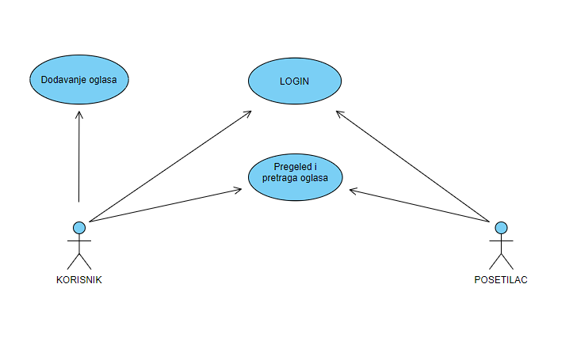

# Aplikacija za oglasavanje vozila

Ovo je projekat za ispit iz predmeta Praktikum - Internet i veb tehnologije.

Broj indeksa: 2018200988

Ime i prezime: Igor Crnogorcevic

Skolska godina: 2021/22

## Projektni zahtev

Aplikacija treba da omogući korisniku da može da postavi oglas za prodaju vozila. Korisnik mora da se registruje i da bude prijavljen da bi dodavao oglas za vozilo na portal. Za svako vozilo treba omogućiti da korisnik obeleži najosnovnija svojstva vozila, kao što su cena, proizvođač, model, kratak opis ograničene dužine, naslovnu fotografiju koju upload-je, kao i karakteristike samog vozila, kao što su vrsta goriva, broj vrata, tip karoserije, boja, zapremina motora, snaga motora, postojanje određenih pogodnosti, kao što je posebna elektronska oprema u vozilu, posebni kočioni sistemi, luksuzna oprema enterijera, ali i određena legalna svojstva vozila, kao što je informacija o tome da li je vozilo registrovano, da li ga prodaje vlasnik ili agencija/posrednik, da li ima svu potrebnu prateću dokumentaciju, itd. Sve ostale osobine, karakteristike i svojstva oglasa ili vozila koja mogu da budu podešena su prednost u smislu realizacije projekta. Neprijavljeni korisnici mogu da vrše pretragu po filterima, npr. opseg cena, opseg snage motora, vrsta goriva, pređeni put vozila, posedovanje određenih pogodnosti (navigacija, multimedijalni plejer, kamere) itd. Rezultati pretrage treba da prikazuju liste vozila, a kada se otvori stranica određenog vozila, svi podaci treba da budu prikazani na pregledan način i da budu jasno uočljivi i dostupni bez dodatnih akcija od strane korisnika. Omogućiti responsive dizajn, tako da stranice za listanje i za prikaz vozila budu prilagođene i za mobilne telefone. Stranice za dodavanje vozila za prijavljene korisnike ne moraju da budu realizovane u responsive dizajnu.

## Tehnicka ogranicenja

- Aplikacija mora da bude realizovana na Node.js platformi korišćenjem Express biblioteke. Aplikacija mora da bude podeljena u dve nezavisne celine: back-end veb servis (API) i front-end (GUI aplikacija). Sav kôd aplikacije treba da bude organizovan u jednom Git spremištu u okviru korisničkog naloga za ovaj projekat, sa podelom kao u primeru zadatka sa vežbi.
- Baza podataka mora da bude relaciona i treba koristiti MySQL ili MariaDB sistem za upravljanje bazama podataka (RDBMS) i u spremištu back-end dela aplikacije mora da bude dostupan SQL dump strukture baze podataka, eventualno sa inicijalnim podacima, potrebnim za demonstraciju rada projekta.
- Back-end i front-end delovi projekta moraju da budi pisani na TypeScript jeziku, prevedeni TypeScript prevodiocem na adekvatan JavaScript. Back-end deo aplikacije, preveden na JavaScript iz izvornog TypeScript koda se pokreće kao Node.js aplikacija, a front-end deo se statički servira sa rute statičkih resursa back-end dela aplikacije i izvršava se na strani klijenta. Za postupak provere identiteta korisnika koji upućuje zahteve back-end delu aplikacije može da se koristi mehanizam sesija ili JWT (JSON Web Tokena), po slobodnom izboru.
- Sav generisani HTML kôd koji proizvodi front-end deo aplikacije mora da bude 100% validan, tj. da prođe proveru W3C Validatorom (dopuštena su upozorenja - Warning, ali ne i greške - Error). Grafički korisnički INTerfejs se generiše na strani klijenta (client side rendering), korišćenjem React biblioteke, dok podatke doprema asinhrono iz back-end dela aplikacije (iz API-ja). Nije neophodno baviti se izradom posebnog dizajna grafičkog INTerfejsa aplikacije, već je moguće koristiti CSS biblioteke kao što je Bootstrap CSS biblioteka. Front-end deo aplikacije treba da bude realizovan tako da se prilagođava različitim veličinama ekrana (responsive design).
- Potrebno je obezbediti proveru podataka koji se od korisnika iz front-end dela upućuju back-end delu aplikacije. Moguća su tri sloja zaštite i to: (1) JavaScript validacija vrednosti na front-end-u; (2) Provera korišćenjem adekvatnih testova ili regularnih izraza na strani servera u back-end-u (moguće je i korišćenjem izričitih šema - Schema za validaciju ili drugim pristupima) i (3) provera na nivou baze podataka korišćenjem okidača nad samim tabelama baze podataka.
- Neophodno je napisati prateću projektnu dokumentaciju o izradi aplikacije koja sadrži (1) model baze podataka sa detaljnim opisom svih tabela, njihovih polja i relacija; (2) dijagram baze podataka; (3) dijagram organizacije delova sistema, gde se vidi veza između baze, back-end, front-end i korisnika sa opisom smera kretanja informacija; (4) popis svih aktivnosti koje su podržane kroz aplikaciju za sve uloge korisnika aplikacije prikazane u obliku Use-Case dijagrama; kao i (5) sve ostale elemente dokumentacije predviđene uputstvom za izradu dokumentacije po ISO standardu.
- Izrada oba dela aplikacije (projekata) i promene kodova datoteka tih projekata moraju da bude praćene korišćenjem alata za verziranje koda Git, a kompletan kôd aplikacije bude dostupan na javnom Git spremištu, npr. na besplatnim GitHub ili Bitbucket servisima, jedno spremište za back-end projekat i jedno za front-end projekat. Ne može ceo projekat da bude otpremljen u samo nekoliko masovnih Git commit-a, već mora da bude pokazano da je projekat realizovan u kontinuitetu, da su korišćene grane (branching), da je bilo paralelnog rada u više grana koje su spojene (merging) sa ili bez konflikata (conflict resolution).

## Baza podataka

- ad
  - ad_id                  PK, INT(10)
  - category_id            FK INT(10)
  - brand_id               FK INT(10)
  - model_id               FK INT(10)
  - user_id                FK INT(10)
  - car_body_id            FK INT(10)
  - fuel_type_id           FK INT(10)
  - drive_id               FK INT(10)
  - transmission_id        FK INT(10)
  - doors_id               FK INT(10)
  - seats_id               FK INT(10)
  - steering_wheel_side_id FK INT(10)
  - air_condition_id       FK INT(10)
  - damage_id              FK INT(10)
  - origin_id              FK INT(10)
  - emission_class_id      FK INT(10)
  - INTerior_material_id   FK INT(10)
  - replacement_id         FK INT(10)
  - title                  VARCHAR (64)
  - price                  DECIMAL (10,2)
  - year                   VARCHAR (4)
  - cm3                    VARCHAR (64)
  - kw                     VARCHAR (12)
  - ks                     VARCHAR (12)
  - mileage                VARCHAR (25)
  - color                  VARCHAR (25)
  - INTerior_color         VARCHAR (25)
  - registration_until     VARCHAR (54)
  - description            TEXT

- ad_equipment
  - ad_equipment_id        PK, INT(10)
  - ad_id                  FK,UQ INT(10)
  - equipment_id           FK,UQ INT(10)

- ad_safety
  - ad_safety_id           PK, INT(10)
  - ad_id                  FK,UQ INT(10)
  - safety_id              FK,UQ INT(10)

- ad_vehicle_condition
  - ad_vehicle_condition_id    PK, INT(10)
  - ad_id                      FK,UQ INT(10)
  - vehicle_condition_id       FK,UQ INT(10)

- air_condition
  - air_conditionair_id    PK, INT(10)
  - name                   VARCHAR (64)

- brand
  - brand_id               PK, INT(10)
  - name                   UQ,VARCHAR, (128)
  - category_id            FK,UQ, INT(10)

- car_body
  - car_body_id            PK, INT(10)
  - name                   VARCHAR (64)

- category
  - category_id            PK, INT(10)
  - name                   UQ, VARCHAR (64)

- damage
  - damage_id              PK, INT(10)
  - name                   VARCHAR (64)

- doors
  - doors_id               PK, INT(10)
  - name                   VARCHAR (64)

- drive
  - drive_id               PK, INT(10)
  - name                   VARCHAR (64)

- emission_class
  - emission_class_id      PK, INT(10)
  - name                   VARCHAR (64)

- equipment
  - equipment_id           PK, INT(10)
  - name                   VARCHAR (64)

- fuel_type
  - fuel_type_id           PK, INT(10)
  - name                   VARCHAR (64)

- interior_material
  - interior_material_id   PK, INT(10)
  - name                   VARCHAR (64)

- model
  - model_id               PK, INT(10)
  - name                   UQ, VARCHAR (64)
  - brand_id               FK,UQ, INT(10)

- origin
  - origin_id              PK, INT(10)
  - name                   VARCHAR (64)

- photo
  - photo_id               PK, INT(10)
  - name                   VARCHAR (64)
  - file_path              UQ, TEXT
  - ad_id                  FK, INT(10)

- replacement
  - replacement_id         PK, INT(10)
  - name                   VARCHAR(64)

- safety
  - safety_id              PK, INT(10)
  - name                   VARCHAR(64)

- seats
  - seats_id               PK, INT(10)
  - name                   VARCHAR(64)

- steering_wheel_side
  - steering_wheel_side_id PK, INT(10)
  - name                   VARCHAR(64)

- transmission
  - transmission_id        PK, INT(10)
  - name                   VARCHAR(64)

- user
  - user_id                PK, INT(10)
  - email                  UQ, VARCHAR(64)
  - password_has           VARCHAR(128)
  - forename               VARCHAR(64)
  - surname                VARCHAR(64)
  - city                   VARCHAR(64)
  - phone_number           VARCHAR(64)
  - is_active              TINT(1)
  - activation_code        VARCHAR(255)

- vehicle_condition
  - vehicle_condition_id   PK, INT(10)
  - name                   VARCHAR(64)

## Use-Case dijagram

## Uloge

#### Korisnik

- Dodavanje oglasa
- Pegled i pretraga oglasa
- Imena podataka

#### Posetilac

- Logovanje
- Registracija
- Pregled i pretraga oglasa
